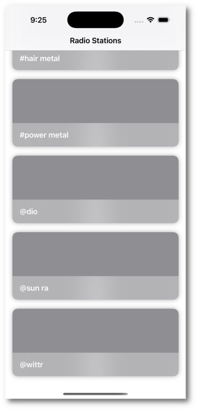

# Tor Jolan

*A Personal Radio Server Powered by Your Own Library and Machine Learning.*

---

Tor Jolan is a native iOS frontend to the
[Boldaric](https://github.com/line72/boldaric/) streaming service.

Tor Jolan allows for creating radio stations and listening to similar
songs based upon their features. You can think of it as a self-hosted,
personal Pandora music service: one with no ads, no data sharing or
tracking, and no algorithmic bias toward popular tracks!

  

    

      
    

    

      
    

  

## What's With The Name?

[Tor Jolan](https://memory-alpha.fandom.com/wiki/Tor_Jolan) is a
famous modern Bajoran composer.

## Features

### Personal Radio

Tor Jolan allows for creating personal radio stations from your
self-hosted music library and listening to them, along with the
ability to thumbs up/thumbs down songs. This allows guiding the
station to your preferences.

This is completely based on features of the song and your individual
preferences, not song popularity or what other people listen to!

### Uses Your Music

Tor Jolan uses YOUR music library! You must have a self-hosted
[Boldaric](https://github.com/line72/boldaric/) server and your music
library self-hosted with a [Subsonic](https://subsonic.org) compatible
server. I test with and recommend
[Navidrome](https://www.navidrome.org/), which is open source.

Recommendations will only come from your library, giving you much more
control over what it plays and what version of songs it plays.

## Requirements

### Your Own Music Collection

Tor Jolan + Boldaric works best with a large, curated personal music
collection.  Boldaric does NOT find and download music for you, nor
will it recommend music that is not in your collection.

Ideally, your music is organized and tagged properly, however, that is
not a strict requirement, as Boldaric uses features of the music
rather than tag information to determine similarity.

### A Boldaric Server

You'll need to self-host
[Boldaric](https://github.com/line72/boldaric/), which is the machine
learning and recommendation server.

### A Subsonic Compatible Server

Tor Jolan + Boldaric focuses on categorizing your music and on recommendation. It
does not do any music organization or streaming itself. It relies on a
[Subsonic](https://subsonic.org) compatible server that it can use to
access your music library. Boldaric players also use Subsonic for
streaming your music stations.

Any Subsonic compatible server should work with Boldaric, however, I
test with and recommend:

- [Navidrome](https://www.navidrome.org/): an open source web-based
  music collection server and streamer.

## Getting Started

TO DO

## License

Tor Jolan is (c) 2025 Marcus Dillavou <line72@line72.net>

Tor Jolan is Licensed under the [AGPLv3 or Later](https://www.gnu.org/licenses/agpl-3.0.en.html).
